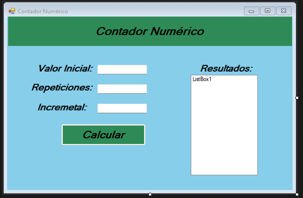
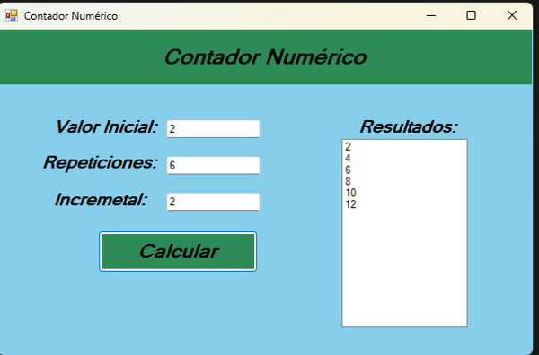

# 🔢 Contador Numérico – Proyecto en Visual Basic .NET

Este proyecto es una aplicación de escritorio desarrollada en Visual Basic usando Visual Studio. El programa permite generar una secuencia numérica controlada por el usuario a través de tres parámetros: **valor inicial**, **cantidad de repeticiones** y **valor incremental**.

---

## 🖥️ Captura de pantalla

### Vista inicial:contador_numerico_vacio.png

### Vista con resultado generado:

---

## 🎯 Objetivo del programa

El usuario introduce tres datos:
- **Valor inicial**: el número desde donde comienza la secuencia.
- **Repeticiones**: cuántos números desea generar.
- **Incremental**: de cuánto en cuánto se aumenta.

Al presionar el botón **“Calcular”**, el programa:
1. Calcula la secuencia.
2. Muestra los valores en un `ListBox`.

---

## 🔧 Tecnologías utilizadas

- Visual Basic .NET
- Visual Studio
- Windows Forms
- Controles: `TextBox`, `ListBox`, `Button`

---

# 📄 Cómo ejecutar el programa

1. Abre el archivo `Tarea 4.2.sln` con Visual Studio.
2. Presiona `F5` o haz clic en “Iniciar” para ejecutar.

---

## 👨‍💻 Autor

Harry Correa  
Estudiante de Sistemas de Información y Tecnología en Redes  
HC Tech Repair
